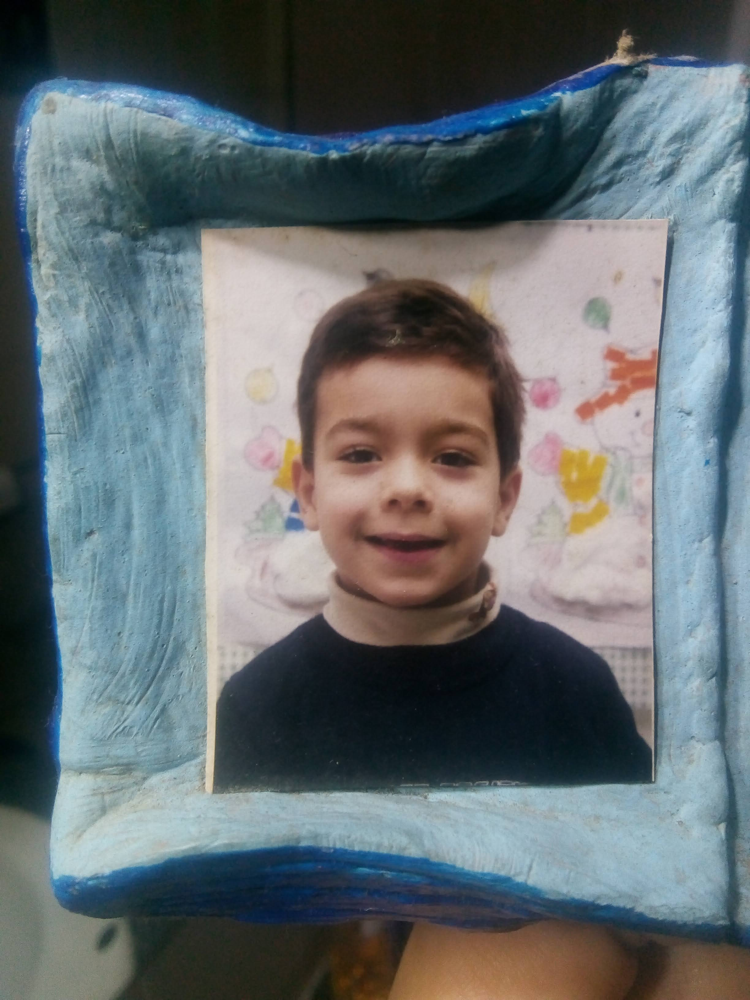
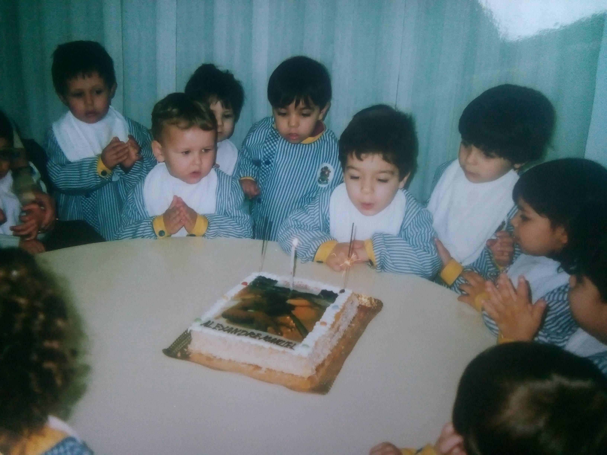
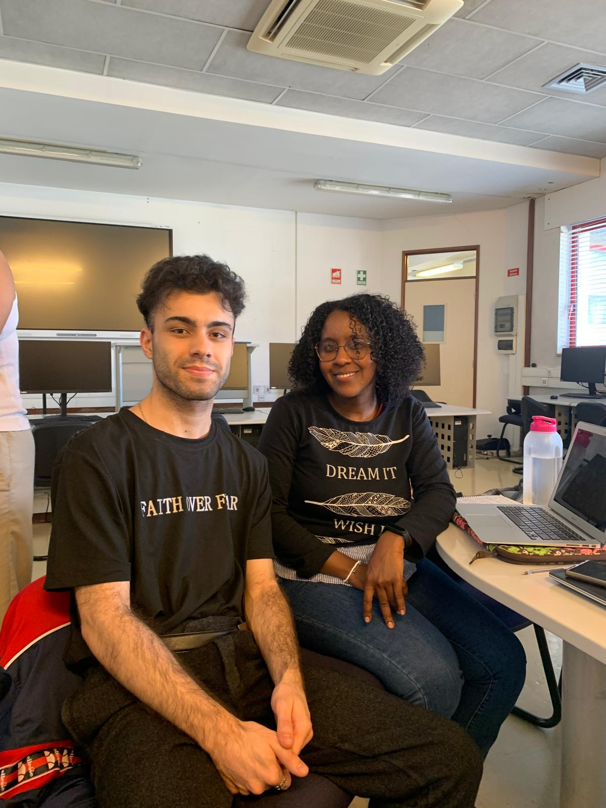

## Metadados da Entrevista

**Título:** Memórias de Infância

**Entrevistadora:** Maria de Fátima Centeio  

**Entrevistado:** Alexandre Machado  

**Data da entrevista:** 3 de Abril de 2025 

**Local:** Universidade do Minho, Braga, Portugal

## Introdução:

A presente entrevista foi realizada no âmbito do projecto Memórias de Infância, com o objectivo de recolher relatos sobre experiências, emoções e tradições vividas durante a infância. O entrevistado foi o meu colega Alexandre, que partilhou comigo algumas das suas recordações mais marcantes.

## 📸 Fotografias Ilustrativas das Memórias de Infância do Alexandre

### Fotografia 1 

**Título:** Retrato de Alexandre em Criança

**Descrição:** Retrato de Alexandre em criança, com um fundo decorado com desenhos coloridos, típico de uma sala de jardim de infância. A imagem transmite a simplicidade e inocência desta fase da vida.

**Pessoa retratada:** Alexandre Machado  

**Local:** Jardim de infância (provavelmente) 

**Data estimada:**  2005  

**Contexto:** Fotografia escolar ou tirada num ambiente infantil

### Fotografia 2 

**Título:** Aniversário de Infância no Infantário

**Descrição:**  Momento captado durante uma festa de aniversário no infantário, em que Alexandre aparece a soprar as velas de um bolo personalizado com o seu nome, rodeado de colegas com batas típicas da escola. As expressões de alegria e expectativa marcam esta recordação.

**Pessoa em destaque:** Alexandre Machado  

**Outras pessoas:** Colegas do infantário  

**Local:** Infantário  

**Data estimada:** 2006  

**Evento:** Festa de aniversário

### Fotografia 3 - Passeio a Peniche

**Título** Fotografia de passeio  

**Descrição:** Registo de um passeio a Peniche, onde Alexandre posa junto a uma embarcação atracada perto de uma falésia. A expressão no seu rosto reflecte a curiosidade e entusiasmo típicos de uma criança em descoberta.

**Pessoa retratada:** Alexandre Machado  

**Local:** Peniche, Portugal

**Data estimada:** 2007 

**Contexto:** Passeio familiar

## Encerramento:
Agradeço muito a sua colaboração, Alexandre. As suas respostas foram muito pertinentes e contribuíram significativamente para o meu trabalho. Desejo-lhe um excelente dia e agradeço o seu tempo.

