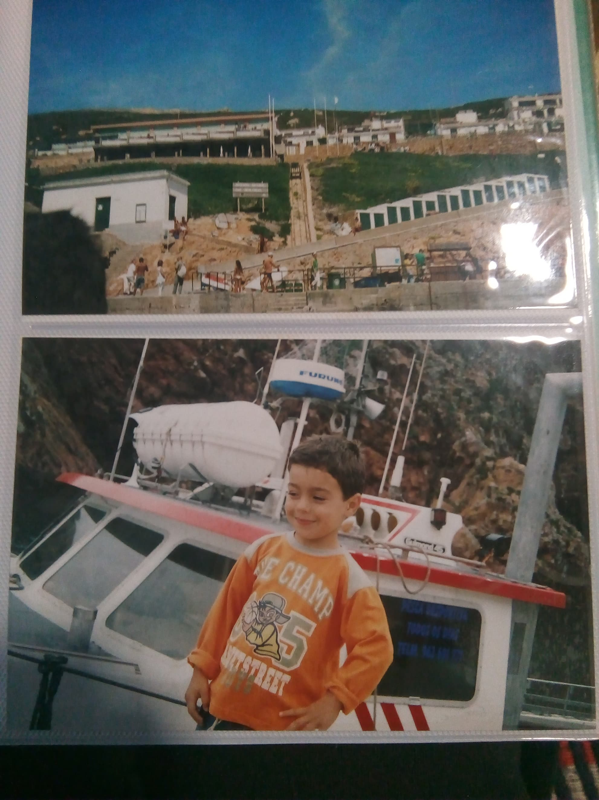

# 📚 Projeto Memórias de Infância

Este repositório integra o projecto **Memórias de Infância**, desenvolvido com o objectivo de recolher relatos, imagens e emoções vividas durante a infância. A presente entrevista foi realizada no dia 3 de Abril de 2025 com Alexandre Machado, estudante da Universidade do Minho.

**Entrevistadora:** Maria de Fátima Centeio  
**Entrevistado:** Alexandre Machado  
**Data da entrevista:** 3 de Abril de 2025  
**Local:** Universidade do Minho

---

## 📸 Fotografias Ilustrativas das Memórias de Infância do Alexandre

### Fotografia 1

**Metadados:**  
- **Tipo de imagem:** Retrato individual  
- **Pessoa retratada:** Alexandre Machado  
- **Local:** Jardim de infância (provavelmente)  
- **Data estimada:** Cerca de 2001  
- **Contexto:** Fotografia escolar ou tirada num ambiente infantil

**Descrição:**  
Retrato de Alexandre em criança, com um fundo decorado com desenhos coloridos, típico de uma sala de jardim de infância. A imagem transmite a simplicidade e inocência desta fase da vida.

---

### Fotografia 2

**Metadados:**  
- **Tipo de imagem:** Fotografia de grupo / celebração  
- **Pessoa em destaque:** Alexandre Machado  
- **Outras pessoas:** Colegas do infantário  
- **Local:** Infantário  
- **Data estimada:** Cerca de 2001  
- **Evento:** Festa de aniversário

**Descrição:**  
Momento captado durante uma festa de aniversário no infantário, em que Alexandre aparece a soprar as velas de um bolo personalizado com o seu nome, rodeado de colegas com batas típicas da escola. As expressões de alegria e expectativa marcam esta recordação.

---

### Fotografia 3

**Metadados:**  
- **Tipo de imagem:** Fotografia de passeio  
- **Pessoa retratada:** Alexandre Machado  
- **Local:** Peniche, Portugal  
- **Data estimada:** Cerca de 2002  
- **Contexto:** Visita turística ou passeio familiar

**Descrição:**  
Registo de um passeio a Peniche, onde Alexandre posa junto a uma embarcação atracada perto de uma falésia. A expressão no seu rosto reflecte a curiosidade e entusiasmo típicos de uma criança em descoberta.

---

